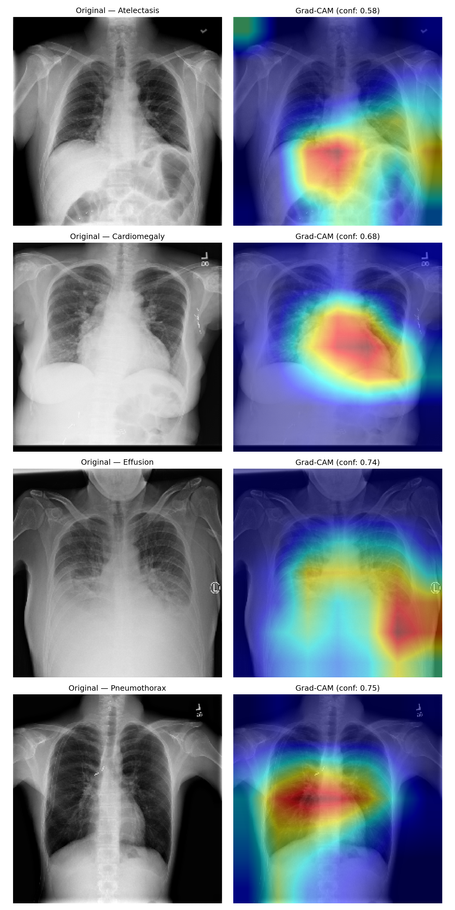

# ChestAI — Chest X-Ray Pathology Classifier

A deep learning system that detects 14 thoracic pathologies from chest X-rays, with Grad-CAM visual explanations for every prediction. Built on the NIH ChestX-ray14 dataset using an EfficientNet-B3 backbone, with a Streamlit demo app for interactive inference.


## Overview

This project fine-tunes a convolutional neural network to perform multi-label classification across 14 chest pathologies, then layers Grad-CAM explainability on top so that every prediction comes with a heatmap showing which regions of the X-ray drove the model's decision. This kind of visual explanation is essential for any clinical or medical imaging AI system, since a black-box prediction is far less trustworthy than one that can point to supporting evidence in the image.

**Key features:**
- Multi-label classification across 14 NIH ChestX-ray14 pathologies
- EfficientNet-B3 backbone fine-tuned with focal loss to handle severe class imbalance
- Grad-CAM explainability targeting the model's final convolutional layer
- Interactive Streamlit web app for uploading X-rays and viewing predictions + heatmaps
- Per-class AUC-ROC tracking and visualization

## Results

The model was trained on the NIH ChestX-ray14 dataset (112,000+ images) with a weighted random sampler and focal loss to address class imbalance, using a warmup + cosine learning rate schedule and early stopping on validation AUC.

**Overall validation AUC-ROC: 0.7946**

| Pathology | AUC-ROC |
|---|---|
| Emphysema | 0.893 |
| Edema | 0.879 |
| Pneumothorax | 0.872 |
| Effusion | 0.849 |
| Cardiomegaly | 0.847 |
| Hernia | 0.831 |
| Mass | 0.819 |
| Atelectasis | 0.788 |
| Fibrosis | 0.775 |
| Consolidation | 0.765 |
| Pleural Thickening | 0.751 |
| Nodule | 0.712 |
| Pneumonia | 0.686 |
| Infiltration | 0.676 |

These results are in line with published benchmarks on the same dataset, where classes like Infiltration and Pneumonia are consistently the hardest to detect due to their diffuse and subtle radiographic presentation, while Emphysema and Cardiomegaly tend to have the clearest visual signatures.

## Grad-CAM Explainability

Every prediction is paired with a Grad-CAM heatmap generated from the model's final convolutional layer (`model.backbone.conv_head`), highlighting the anatomical regions that most influenced the classification. Below are example outputs for several pathologies, each correctly localizing to the expected anatomical region:



- **Cardiomegaly** — heatmap centers on the heart silhouette
- **Effusion** — heatmap localizes to the lower lung field where fluid accumulates
- **Pneumothorax** — heatmap highlights the lung periphery
- **Atelectasis** — heatmap activates across the central/bilateral lung fields

## Demo App

A Streamlit app lets you upload any frontal chest X-ray and instantly see:
- The top predicted pathology with a confidence score
- A full probability breakdown across all 14 classes
- A side-by-side Grad-CAM visualization for the top prediction
- Per-class validation AUC reference chart


### Running the app locally

```bash
git clone https://github.com/<your-username>/medical-xray-classifier.git
cd medical-xray-classifier
python -m venv venv
source venv/bin/activate  # Windows: venv\Scripts\activate
pip install -r requirements.txt
streamlit run app/streamlit_app.py
```

The app will open at `http://localhost:8501`. Upload a PNG or JPG chest X-ray to get started.

## Architecture

```
Input X-ray (224x224x3)
        |
EfficientNet-B3 backbone (ImageNet pretrained)
        |
Global pooling + classifier head
        |
14 sigmoid outputs (multi-label)
        |
Grad-CAM (target: backbone.conv_head)
```

**Training details:**
- Loss: Focal loss (alpha=0.25, gamma=2.0) to handle class imbalance
- Optimizer: AdamW, lr=3e-4, weight decay=1e-4
- Schedule: 3-epoch linear warmup followed by cosine decay
- Sampling: Weighted random sampler based on inverse class frequency
- Early stopping: patience of 8 epochs on validation AUC
- Mixed precision training (AMP) on a single T4 GPU

## Project Structure

```
medical-xray-classifier/
├── app/
│   └── streamlit_app.py      # Interactive demo application
├── src/
│   ├── dataset.py            # Dataset loading, transforms, class definitions
│   ├── model.py               # EfficientNet-B3 classifier architecture
│   ├── train.py                # Training loop, loss, scheduler
│   ├── inference.py           # Single-image prediction pipeline
│   └── gradcam.py             # Grad-CAM heatmap generation
├── notebooks/
│   └── train_model.ipynb     # Kaggle training notebook (GPU)
├── models/
│   └── best_model.pth         # Trained model checkpoint
├── training_curves.png        # Loss/AUC curves over training
├── requirements.txt
└── README.md
```

## Dataset

[NIH ChestX-ray14](https://www.kaggle.com/datasets/nih-chest-xrays/data) — 112,120 frontal-view chest X-rays from 30,805 unique patients, labeled with up to 14 thoracic pathologies extracted from radiology reports via NLP. This is one of the largest publicly available chest X-ray datasets and a standard benchmark for medical imaging classification research.

## Limitations and Disclaimer

This model is a research and portfolio project and is **not intended for clinical use**. The labels in the underlying NIH dataset were extracted automatically from radiology reports rather than verified by radiologists for this specific task, and the model has not undergone any clinical validation. Performance also varies meaningfully by pathology, with classes like Infiltration and Pneumonia substantially harder to detect than classes like Cardiomegaly or Emphysema, reflecting both the inherent difficulty of the underlying radiographic findings and known limitations of the dataset's label quality.

## Acknowledgments

- NIH Clinical Center for the ChestX-ray14 dataset
- `timm` library for the EfficientNet-B3 implementation
- `pytorch-grad-cam` for the Grad-CAM implementation
